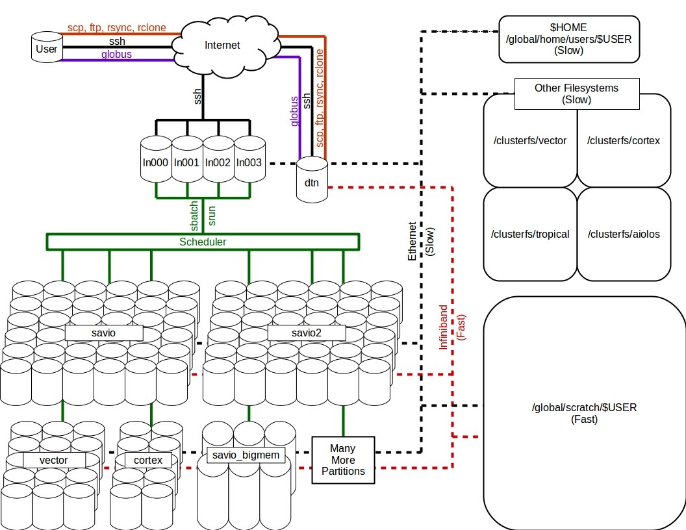

% Savio introductory training: Basic usage of the Berkeley Savio high-performance computing cluster
% October 14, 2022
% Christian White, Chris Paciorek, and Clint Hamilton

# Upcoming events and hiring

[TODO: check with Amy about what to have here]

 - [Cloud Computing Meetup](https://www.meetup.com/ucberkeley_cloudmeetup/) (monthly)

 - We offer platforms and services for researchers working with [sensitive data](https://docs-research-it.berkeley.edu/services/srdc/)

 - Get paid to develop your skills in research data and computing! Berkeley Research Computing is hiring several graduate student Domain Consultants for flexible appointments, 10% to 25% effort (4-10 hours/week). Email your cover letter and CV to: research-it@berkeley.edu.

# Introduction

We'll do this mostly as a demonstration. We encourage you to login to your account and try out the various examples yourself as we go through them.

Much of this material is based on the extensive Savio documention we have prepared and continue to prepare, available at [https://docs-research-it.berkeley.edu/services/high-performance-computing/](https://docs-research-it.berkeley.edu/services/high-performance-computing/).

The materials for this tutorial are available using git at the short URL ([tinyurl.com/brc-oct22](https://tinyurl.com/brc-oct22)), the  GitHub URL ([https://github.com/ucb-rit/savio-training-intro-fall-2022](https://github.com/ucb-rit/savio-training-intro-fall-2022)), or simply as a [zip file](https://github.com/ucb-rit/savio-training-intro-fall-2022/archive/main.zip).

# Outline

This training session will cover the following topics:

 - Introductory content
     - Basic parallel computing concepts
     - High level overview of system
 - System capabilities and hardware
     - Getting access to the system - FCA, condo, ICA
     - Login nodes, compute nodes, and DTN nodes
     - Savio computing nodes
     - Disk space options (home, scratch, group, condo storage)
 - Logging in, data transfer, and software
     - Logging in
     - Data transfer
        - SCP/SFTP
        - Globus
        - Box & bDrive (Google drive)
     - Software modules
 - Submitting and monitoring jobs
     - Acounts and partitions
     - Basic job submission
     - Parallel jobs
     - Interactive jobs
     - Low-priority queue
     - HTC jobs
     - Monitoring jobs and cluster status
 - Basic use of standard software: Python
     - Jupyter notebooks using OOD
     - Parallelization in Python with ipyparallel
     - Dask for parallelization in Python
 - More information
     - How to get additional help
     - Upcoming events

# Basic Parallel Computing Concepts Pt. 1

[TODO: update in light of question of whether participants are familiar with this terminology, particularly given savio4 will be shared nodes bydefault and that we now have OOD for which users are ofen doing serial work.]

- Who is Savio for?
- Types of computation (Flynn's taxonomy)
   1. Single command, Single Data
   2. Single command, Multiple data
   3. Multiple command, Multiple data
   4. (Multiple Instruction, Single data)
- Savio is (generally) best for cases 2 & 3

# Basic Parallel Computing Concepts Pt. 2

- What is Savio?
  - In layman's terms:
    - A collection of really powerful computers (nodes)
    - Some really big, fast hard drives
- Two types of parallel Computing
  - Shared memory (e.g., OpenMP)
    - All computation on the same node
    - Can have shared objects in ram
  - Distributed memory (e.g., MPI)
    - Computation on multiple nodes
    - Special attention to passing information between nodes


# Getting access to the system - FCA and condo

- All regular Berkeley faculty can request 300,000 service units (roughly core-hours) per year through the [Faculty Computing Allowance (FCA)](https://docs-research-it.berkeley.edu/services/high-performance-computing/getting-account/faculty-computing-allowance/)
- Researchers can also purchase nodes for their own priority access and gain access to the shared Savio infrastructure and to the ability to *burst* to additional nodes through the [condo cluster program](https://docs-research-it.berkeley.edu/services/high-performance-computing/condos/condo-cluster-service/)
- Instructors can request an [Instructional Computing Allowance (ICA)](https://docs-research-it.berkeley.edu/services/high-performance-computing/getting-account/instructional-computing-allowance/).
- The application process has gotten even easier with the introduction of the [MyBRC](https://mybrc.brc.berkeley.edu/), the Berkeley Research Computing Access Management System
- Please bear in mind that applications have to be manually reviewed before they can be approved.

Faculty/principal investigators can allow researchers working with them to get user accounts with access to the FCA or condo resources available to the faculty member.


# System capabilities and hardware

- Savio is a >600-node, >15,000-core Linux cluster rated at nearly 540 peak teraFLOPS.
   - about 40% of the  compute nodes provided by the institution for general access
   - about 60% compute nodes contributed by researchers in the Condo program

# The Savio cluster

Savio is a Linux cluster - by cluster we mean a set of computers networked together

- Savio has 3 kinds of nodes:
  - Login nodes
  - Data transfer nodes
  - Compute nodes


# Login nodes

- Login nodes
  - Used to access the system when logging in
  - For login and non-intensive interactive work such as:
    - job submission and monitoring
    - basic compilation
    - managing your disk space

# Data transfer nodes

- Data transfer nodes
  - For transferring data to/from Savio
  - This is a notable difference from many other clusters
    - Login node: `hpc.brc.berkeley.edu`
    - Data transfer node: `dtn.brc.berkeley.edu`
    - Some applications may look for SFTP via login node
- Note: you can access your files on the system from any of the computers

# Compute nodes

- Compute nodes
  - For computational tasks
  - Your work might use parallelization to do computation on more than one CPU
  - You can also run "serial" jobs that use a single CPU

# Savio computing node types

- There are multiple types of computation nodes with different hardware specifications [(see the *Hardware Configuration* page)](https://docs-research-it.berkeley.edu/services/high-performance-computing/user-guide/hardware-config/).

- The nodes are divided into several pools, called *partitions*
- These partitions have different restrictions and costs associated with them
   - [see the *Scheduler Configuration* page](https://docs-research-it.berkeley.edu/services/high-performance-computing/user-guide/running-your-jobs/scheduler-config/)
  - and [the associated costs in Service Units](https://docs-research-it.berkeley.edu/services/high-performance-computing/user-guide/running-your-jobs/service-units-savio/)

- Any job you submit must be submitted to a partition to which you have access.

# Conceptual diagram of Savio

<center></center>

# Disk space options (home, scratch, group, condo storage)

- You have access to the multiple kinds of disk space, described [here in the *Storing Data* page](https://docs-research-it.berkeley.edu/services/high-performance-computing/user-guide/storing-data/).
- There are 3 directories:
  - `/global/home/users/SAVIO_USERNAME`
    - 10 GB per user, backed up
  - `/global/home/groups/SAVIO_GROUPNAME`
    - Per group: 30 GB for FCA, 200 GB for Condo
  - `/global/scratch/users/SAVIO_USERNAME`
    - Connected via Infiniband (very fast)
    - Primary data storage during computation
- All 3 are available from any of the nodes and changes to files on one node will be seen on all the other nodes
- Large amounts of disk space is available for purchase from the [*condo storage* offering](https://docs-research-it.berkeley.edu/services/high-performance-computing/condos/condo-storage-service/).
  - The minimum purchase is about $5,750, which provides roughly 112 TB for five years.

# Using disk space

- When reading/writing data to/from disk put the data in your scratch space at `/global/scratch/users/SAVIO_USERNAME`
- The system is set up so that disk access for all users is optimized when users are doing input/output (I/O) off of scratch rather than off of their home directories
- Doing I/O with files on your home directory can impact the ability of others to access their files on the filesystem


# Sensitive Data on Savio


- Savio (and AEoD) is [certified for moderately sensitive data](https://docs-research-it.berkeley.edu/services/high-performance-computing/getting-account/sensitive-accounts/)
  - P2, P3 (formerly PL1) and NIH dbGap (non-"notice-triggering" data).
- PIs/faculty must request a P2/P3 project alongside requests for a new FCA/condo allocation
  - Existing projects can't be converted to P2/P3 projects.
- BRC has a new platform for highly sensitive data (P4) called SRDC.

More info is available in [our documentation](https://docs-research-it.berkeley.edu/services/srdc/) or on [our website](https://research-it.berkeley.edu/services-projects/secure-research-data-computing).

# Logging in: Getting Set Up

- To login, you need to have software on your own machine that gives you access to the SSH command
  - These come built-in with Mac (see `Applications -> Utilities -> Terminal`).
  - For Windows, you can use Powershell (or Command Prompt)
    - Other applications such as [MobaXterm](https://mobaxterm.mobatek.net/) may offer more functionality
- You also need to set up your smartphone or tablet with *Google Authenticator* to generate one-time passwords for you.
- Here are instructions for [doing this setup, and for logging in](https://docs-research-it.berkeley.edu/services/high-performance-computing/user-guide/logging-brc-clusters/).

# Logging in

Then to login:
```
ssh SAVIO_USERNAME@hpc.brc.berkeley.edu
```

- Then enter XXXXXYYYYYY where XXXXXX is your PIN and YYYYYY is the one-time password. YYYYYY will be shown when you open your *Google authenticator* app on your phone/tablet.

- One can then navigate around and get information using standard UNIX commands such as `ls`, `cd`, `du`, `df`, etc.
  - There is a lot of material online about using the UNIX command line
    - Also called the shell; 'bash' is one common variation
  - Here is a [basic tutorial](https://github.com/berkeley-scf/tutorial-unix-basics).

# Graphical Interface

If you want to be able to open programs with graphical user interfaces:
```
ssh -Y SAVIO_USERNAME@hpc.brc.berkeley.edu
```

- To display the graphical windows on your local machine, you'll need X server software on your own machine to manage the graphical windows
  - For Windows, your options include *MobaXterm*, *eXceed*, or *Xming*
  - For Mac, there is *XQuartz*

# Editing files

You are welcome to edit your files on Savio (rather than copying files back and forth from your laptop and editing them on your laptop). To do so you'll need to use some sort of editor. Savio has `vim`, `emacs`, and `nano` installed. Just start the editor from a login node.

```
## To use vim
vim myfile.txt
## To use emacs
emacs myfile.txt
## To use nano
module load nano
nano myfile.txt
```

# Data transfer with examples to/from laptop, Box, Google Drive, AWS

To do any work on the system, you'll usually need to transfer files (data files, code files, etc.) to the Savio filesystem, either into your home directory, your scratch directory or a group directory.

And once you're done with a computation, you'll generally need to transfer files back to another place (e.g., your laptop).

Let's see how we would transfer files/data to/from Savio using a few different approaches.

# Data transfer for smaller files: SCP

- The most common command line protocol for file transfer is *SCP*

- You need to use the Savio data transfer node, `dtn.brc.berkeley.edu`.

- The example file `bayArea.csv` is too large to store on Github; you can obtain it [here](https://www.stat.berkeley.edu/share/paciorek/bayArea.csv).

- SCP is supported in terminal for Mac/Linux and in Powershell/Command Prompt in Windows

```bash
# to Savio, while on your local machine
scp bayArea.csv hannsode@dtn.brc.berkeley.edu:~/.
scp bayArea.csv hannsode@dtn.brc.berkeley.edu:~/data/newName.csv
scp bayArea.csv hannsode@dtn.brc.berkeley.edu:/global/scratch/users/paciorek/.

# from Savio, while on your local machine
scp hannsode@dtn.brc.berkeley.edu:~/data/newName.csv ~/Documents/.
```

If you can ssh to your local machine or want to transfer files to other systems on to which you can ssh, you can login to the dtn node to execute the scp commands:

```
ssh SAVIO_USERNAME@dtn.brc.berkeley.edu
[SAVIO_USERNAME@dtn ~]$ scp ~/file.csv OTHER_USERNAME@other.domain.edu:~/data/.
```

If you're already connected to a Savio login node, you can use `ssh dtn` to login to the dtn.

Pro tip: You can package multiple files (including directory structure) together using tar
```
tar -cvzf files.tgz dir_to_zip
# to untar later:
tar -xvzf files.tgz
```

# Data transfer for smaller files: SFTP

- Another common method for file transfer is *SFTP*
- A multi-platform program for doing transfers via SFTP is [FileZilla](https://filezilla-project.org/).
- After logging in to most *SFTP* applications, you'll see windows for the Savio filesystem and your local filesystem on your machine. You can drag files back and forth.

# Data transfer for larger files: Globus, Intro


- You can use Globus Connect to transfer data data to/from Savio (and between other resources) quickly and unattended
  - This is a better choice for large transfers
  - Here are some [instructions](https://docs-research-it.berkeley.edu/services/high-performance-computing/user-guide/transferring-data/using-globus-connect-savio/).

- Globus transfers data between *endpoints*
  - Possible endpoints include
    - Savio
    - your laptop or desktop
    - Other clusters like NERSC and XSEDE
    - Box and bDrive (details coming soon)
    - Collaborators & other researchers

# Data transfer for larger files: Globus, requirements

- If you are transferring to/from your laptop, you'll need
  1. Globus Connect Personal set up,
  2. your machine established as an endpoint, and
  3. Globus Connect Personal actively running on your machine. At that point you can proceed as below.

- Savio's endpoint is named `ucb#brc`.

# Data transfer for larger files: Globus, Setup

- To transfer files, you open Globus at [globus.org](https://globus.org) and authenticate to the endpoints you want to transfer between.
  - This means that you only need to authenticate once, whereas you might need to authenticate multiple times with scp and sftp.
  - You can then start a transfer and it will proceed in the background, including restarting if interrupted.

- Globus also provides a [command line interface](https://docs.globus.org/cli/) that will allow you to do transfers programmatically
  - Thus a transfer could be embedded in a workflow script.


# Data transfer: Box & bDrive

- Box and bDrive (the Cal branded Google Drive) both provide free, secured, and encrypted content storage of files to Berkeley affiliates
  - They are both good options for backup and long-term storage of data that you plan to shuttle in and out of Savio
  - Box quotas coming into effect October 27th, 2021
    - 50GB for new individual accounts
    - 500GB for new Special Purpose Accounts ("SPAs")
    - Existing accounts will be allowed up to 10% above current storage amount
  - bDrive provides unlimited storage (for now)
    - Similar limits to Box are likely for bDrive in the near future
    - bDrive has a maximum file size of 5Tb, Box has a maximum file size of 15 Gb
  - These change reflect service provider price increases which may increasingly fall on researchers for **large** datasets
- Alternative paid options are also available
  - Cloud storage options include Amazon, Google, Microsoft Azure, and Wasabi
    - See the [bCloud web page](https://technology.berkeley.edu/services/cloud) for more information
  - As mentioned earlier, Condo computing contributors can also buy into the condo storage program

# Data transfer: Box & bDrive Access

- You can interact with both services via web browser, and both services provide a desktop app you can use to move and sync files between your computer and the cloud.
  - [bDrive web app](http://bdrive.berkeley.edu/)
  - [Drive desktop app](https://www.google.com/drive/download/)
  - [Box web app](http://box.berkeley.edu)
  - [Box desktop app](https://www.box.com/resources/downloads)

- BRC is working  on making Globus available for transfer to/from Box and bDrive
  - We hope this will be available in the near future

For more ambitious users, Box has a Python-based SDK that can be used to write scripts for file transfers. For more information on how to do this, check out the `BoxAuthenticationBootstrap.ipynb` and `TransferFilesFromBoxToSavioScratch.ipynb` from BRC's cyberinfrastructure engineer on [GitHub](https://github.com/ucberkeley/brc-cyberinfrastructure/tree/dev/analysis-workflows/notebooks)

# Data transfer: Box & bDrive with rclone setup

[*rclone*](https://rclone.org/) is a command line program that you can use to sync files between both services and Savio. You can read instructions for using rclone on Savio [with Box or bDrive here](https://docs-research-it.berkeley.edu/services/high-performance-computing/user-guide/transferring-data/rclone-box-bdrive/).

Briefly the steps to set up *rclone* on Savio to interact with Box are as follows:

- Configuration (on dtn): ```rclone config```
 - Use auto config? -> n
 - For Box: install rclone on your PC, then run ```rclone authorize "box"```
 - Paste the link into your browser and log in to your CalNet account
 - Copy the authentication token and paste into the ```rclone config``` prompt on Savio

 Finally you can set up [special purpose accounts](https://calnetweb.berkeley.edu/calnet-departments/special-purpose-accounts-spa) so files are owned at a project level rather than by individuals.


# Data transfer: Box & bDrive with rclone practice

*rclone* basics:

- Switch to DTN before using if on login node
  - Use command ```ssh dtn```
  - If using *rclone* on another node You need to load *rclone* before use
    - Run command ```module load rclone```
- All *rclone* commands begin with ```rclone``` and are then followed by a commands
  - The commands are different from bash (i.e., ```cp``` in *bash* vs. ```copy``` in rclone)
- To reference a file on the remote you add configured remote name followed by a colon followed by the file path
  - For example ```clint_bdrive:project_folder```
  - To access the main folder leave nothing after the colon (e.g., ```clint_bdrive:```)
- For more tips and tricks see [our docs](https://docs-research-it.berkeley.edu/services/high-performance-computing/user-guide/transferring-data/rclone-box-bdrive/)

*rclone* example:
```
rclone listremotes # Lists configured remotes.
rclone lsd remote_name: # Lists directories, but not files. Note the trailing colon.
rclone size remote_name:home # Prints size and number of objects in remote "home" directory. This can take a very long time when tallying Tbs of files.
rclone copy /global/home/users/hannsode remote_name:savio_home/hannsode # Copies my entire home directory to a new directory on the remote.
rclone copy /global/scratch/users/hannsode/genomes remote_name:genome_sequences # Copies entire directory contents to a dirctory on the remote with a new name.
```

# Software modules

A lot of software is available on Savio but needs to be loaded from the relevant software module before you can use it.

(We do this not to confuse you but to avoid clashes between incompatible software and allow multiple versions of a piece of software to co-exist on the system.)

```
module list  # what's loaded?
module avail  # what's available
```

One thing that tricks people is that some the modules are arranged in a hierarchical (nested) fashion, so you only see some of the modules as being available *after* you load the parent module (e.g., MKL, FFT, and HDF5/NetCDF software are nested within the gcc module). Here's how we see and load MPI.

```
module load openmpi  # this fails if gcc not yet loaded
module load gcc
module avail
module load openmpi
```

Note that a variety of Python packages are available simply by loading the python module. For R this is not the case, but you can load the *r-packages* module (as well as the *r-spatial* module for GIS/spatial-related packages).

# Submitting jobs: overview

All computations are done by submitting jobs to the scheduling software that manages jobs on the cluster, called SLURM.

Why is this necessary? Otherwise your jobs would be slowed down by other people's jobs running on the same node. This also allows everyone to share Savio in a fair way.

The basic workflow is:

 - login to Savio; you'll end up on one of the login nodes in your home directory
 - use `cd` to go to the directory from which you want to submit the job
 - submit the job using `sbatch` (or an interactive job using `srun`, discussed later)
    - when your job starts, the working directory will be the one from which the job was submitted
    - the job will be running on a compute node, not the login node

# Submitting jobs: accounts and partitions

When submitting a job, the main things you need to indicate are the project account you are using and the partition. Note that there is a default value for the project account, but if you have access to multiple accounts such as an FCA and a condo, it's good practice to specify it.

You can see what accounts you have access to and which partitions within those accounts as follows:

```
sacctmgr -p show associations user=$USER
```

Here's an example of the output for a user who has access to an FCA and a condo:
```
Cluster|Account|User|Partition|Share|GrpJobs|GrpTRES|GrpSubmit|GrpWall|GrpTRESMins|MaxJobs|MaxTRES|MaxTRESPerNode|MaxSubmit|MaxWall|MaxTRESMins|QOS|Def QOS|GrpTRESRunMins|
brc|fc_paciorek|paciorek|savio3_gpu|1|||||||||||||gtx2080_gpu3_normal,savio_lowprio,v100_gpu3_normal|gtx2080_gpu3_normal||
brc|fc_paciorek|paciorek|savio3_htc|1|||||||||||||savio_debug,savio_normal|savio_normal||
brc|fc_paciorek|paciorek|savio3_bigmem|1|||||||||||||savio_debug,savio_normal|savio_normal||
brc|fc_paciorek|paciorek|savio3|1|||||||||||||savio_debug,savio_normal|savio_normal||
brc|fc_paciorek|paciorek|savio2_1080ti|1|||||||||||||savio_debug,savio_normal|savio_normal||
brc|fc_paciorek|paciorek|savio2_knl|1|||||||||||||savio_debug,savio_normal|savio_normal||
brc|fc_paciorek|paciorek|savio2_gpu|1|||||||||||||savio_debug,savio_normal|savio_normal||
brc|fc_paciorek|paciorek|savio2_htc|1|||||||||||||savio_debug,savio_long,savio_normal|savio_normal||
brc|fc_paciorek|paciorek|savio2_bigmem|1|||||||||||||savio_debug,savio_normal|savio_normal||
brc|fc_paciorek|paciorek|savio2|1|||||||||||||savio_debug,savio_normal|savio_normal||
brc|fc_paciorek|paciorek|savio|1|||||||||||||savio_debug,savio_normal|savio_normal||
brc|fc_paciorek|paciorek|savio_bigmem|1|||||||||||||savio_debug,savio_normal|savio_normal||
brc|co_stat|paciorek|savio3_htc|1|||||||||||||savio_lowprio|savio_lowprio||
brc|co_stat|paciorek|savio3_bigmem|1|||||||||||||savio_lowprio|savio_lowprio||
brc|co_stat|paciorek|savio3|1|||||||||||||savio_lowprio|savio_lowprio||
brc|co_stat|paciorek|savio2_1080ti|1|||||||||||||savio_lowprio|savio_lowprio||
brc|co_stat|paciorek|savio2_knl|1|||||||||||||savio_lowprio|savio_lowprio||
brc|co_stat|paciorek|savio2_bigmem|1|||||||||||||savio_lowprio|savio_lowprio||
brc|co_stat|paciorek|savio2_gpu|1|||||||||||||savio_lowprio,stat_gpu2_normal|stat_gpu2_normal||
brc|co_stat|paciorek|savio2_htc|1|||||||||||||savio_lowprio|savio_lowprio||
brc|co_stat|paciorek|savio|1|||||||||||||savio_lowprio|savio_lowprio||
brc|co_stat|paciorek|savio_bigmem|1|||||||||||||savio_lowprio|savio_lowprio||
brc|co_stat|paciorek|savio2|1|||||||||||||savio_lowprio,stat_savio2_normal|stat_savio2_normal||
```

If you are part of a condo, you'll notice that you have *low-priority* access to certain partitions. For example, user 'paciorek' is part of the statistics condo *co_stat*, which purchased some savio2 nodes and savio2_gpu nodes and therefore has normal access to those, but he can also burst beyond the condo and use other partitions at low-priority (see below).

In contrast, through his FCA, 'paciorek' has access to the savio, savio2, and savio3 partitions as well as various big memory, HTC, and GPU partitions, all at normal priority.

# Submitting a batch job

Let's see how to submit a simple job. If your job will only use the resources on a single node, you can do the following.

Here's an example job script that I'll run. You'll need to modify the --account value and possibly the --partition value.

```bash
#!/bin/bash
# Job name:
#SBATCH --job-name=test
#
# Account:
#SBATCH --account=fc_paciorek
#
# Partition:
#SBATCH --partition=savio2
#
# Wall clock limit (5 minutes here):
#SBATCH --time=00:05:00
#
## Command(s) to run:
module load python/3.9.12
python calc.py >& calc.out
```

Now let's submit and monitor the job:

```
sbatch job.sh

squeue -j <JOB_ID>

wwall -j <JOB_ID>
```

After a job has completed (or been terminated/cancelled), you can review the maximum memory used via the sacct command.

```
sacct -j <JOB_ID> --format=JobID,JobName,MaxRSS,Elapsed
```

MaxRSS will show the maximum amount of memory that the job used in kilobytes.

You can also login to the node where you are running and use commands like *top* and *ps*:

```
srun --jobid=<JOB_ID> --pty /bin/bash
```

NOTE: except for the partitions named *_htc and *_gpu, all jobs are given exclusive access to the entire node or nodes assigned to the job (and your account is charged for all of the cores on the node(s)).


# Parallel job submission

If you are submitting a job that uses multiple nodes, you'll need to carefully specify the resources you need. The key flags for use in your job script are:

 - `--nodes` (or `-N`): indicates the number of nodes to use
 - `--ntasks-per-node`: indicates the number of tasks (i.e., processes) one wants to run on each node
 - `--cpus-per-task` (or `-c`): indicates the number of cpus to be used for each task

In addition, in some cases it can make sense to use the `--ntasks` (or `-n`) option to indicate the total number of tasks and let the scheduler determine how many nodes and tasks per node are needed. In general `--cpus-per-task` will be one except when running threaded code.  

Here's an example job script for a job that uses MPI for parallelizing over multiple nodes:

```bash
#!/bin/bash
# Job name:
#SBATCH --job-name=test
#
# Account:
#SBATCH --account=account_name
#
# Partition:
#SBATCH --partition=partition_name
#
# Number of MPI tasks needed for use case (example):
#SBATCH --ntasks=40
#
# Processors per task:
#SBATCH --cpus-per-task=1
#
# Wall clock limit:
#SBATCH --time=00:00:30
#
## Command(s) to run (example):
module load intel openmpi
mpirun ./a.out
```

When you write your code, you may need to specify information about the number of cores to use. SLURM will provide a variety of variables that you can use in your code so that it adapts to the resources you have requested rather than being hard-coded.

Here are some of the variables that may be useful: SLURM_NTASKS, SLURM_CPUS_PER_TASK, SLURM_NODELIST, SLURM_NNODES.

NOTE: when submitting GPU jobs [you need to request multiple CPUs per GPU](https://docs-research-it.berkeley.edu/services/high-performance-computing/user-guide/running-your-jobs/submitting-jobs/#gpu-jobs) (usually 2 GPUs, but for some of the GPU types in savio3_gpu, 4 or 8 GPUs).

# Parallel job submission patterns

Some common paradigms are:

 - 1 node, many CPUs
     - openMP/threaded jobs - 1 task, *c* CPUs for the task
     - Python/R/GNU parallel - many tasks, 1 per CPU at any given time
 - many nodes, many CPUs
     - MPI jobs that use 1 CPU per task for each of *n* tasks, spread across multiple nodes
     - Python/R/GNU parallel - many tasks, 1 per CPU at any given time
 - hybrid jobs that use *c* CPUs for each of *n* tasks
     - e.g., MPI+threaded code

We have lots more [examples of job submission scripts](https://docs-research-it.berkeley.edu/services/high-performance-computing/user-guide/running-your-jobs/scheduler-examples) for different kinds of parallelization (multi-node (MPI), multi-core (openMP), hybrid, etc.


# Interactive jobs

You can also do work interactively. This simply moves you from a login node to a compute node.

```
srun -A fc_paciorek -p savio2_htc  -c 1 -t 10:0 --pty bash

# note that you end up in the same working directory as when you submitted the job

# now execute on the compute node:
env | grep SLURM
module load matlab
matlab -nodesktop -nodisplay
```

To end your interactive session (and prevent accrual of additional charges to your FCA), simply enter `exit` in the terminal session.

NOTE: you are charged for the entire node when running interactive jobs (as with batch jobs) except in the HTC and GPU (*_htc and *_gpu) partitions.

# Running graphical interfaces interactively 

If you are running a graphical interface, we recommend you use [Savio's Open OnDemand interface](https://ood.brc.berkeley.edu) (more in a later slide), e.g.,

 - Jupyter Notebooks
 - RStudio
 - the MATLAB GUI
 - VS Code
 - remote desktop

# Low-priority queue

Condo users have access to the broader compute resource that is limited only by the size of partitions, under the *savio_lowprio* QoS (queue). However this QoS does not get a priority as high as the general QoSs, such as *savio_normal* and *savio_debug*, or all the condo QoSs, and it is subject to preemption when all the other QoSs become busy.

More details can be found [in the *Low Priority Jobs* section of the user guide](https://docs-research-it.berkeley.edu/services/high-performance-computing/user-guide/running-your-jobs/submitting-jobs/#low-priority).

Suppose I wanted to burst beyond the Statistics condo to run on 20 nodes. I'll illustrate here with an interactive job though usually this would be for a batch job.


```
## First I'll see if there are that many nodes even available.
sinfo -p savio2
srun -A co_stat -p savio2 --qos=savio_lowprio --nodes=20 -t 10:00 --pty bash

## now look at environment variables to see my job can access 20 nodes:
env | grep SLURM
```

The low-priority queue is also quite useful for accessing specific GPU types in the `savio3_gpu` partition.

# HTC jobs (and long-running jobs)

There are multiple "HTC" partitions (savio2_htc, savio3_htc, savio4_htc [coming soon]) that allow you to request cores individually rather than an entire node at a time. In some cases the nodes in these partition are faster than the other nodes. Here is an example SLURM script:

```
#!/bin/bash
# Job name:
#SBATCH --job-name=test
#
# Account:
#SBATCH --account=account_name
#
# Partition:
#SBATCH --partition=savio3_htc
#
# Processors per task:
#SBATCH --cpus-per-task=2
#
# Wall clock limit -- 10 minutes
#SBATCH --time=00:10:00
#
## Command(s) to run (example):
module load python/3.9.12
python calc.py >& calc.out
```

One can run jobs up to 10 days (using four or fewer cores) in the *savio2_htc* partition if you include `--qos=savio_long`.

# Alternatives to the HTC partition for collections of serial jobs

You may have many serial jobs to run. It may be more cost-effective to collect those jobs together and run them across multiple cores on one or more nodes.

Here are some options:

  - using [GNU parallel](https://docs-research-it.berkeley.edu/services/high-performance-computing/user-guide/running-your-jobs/gnu-parallel/) to run many computational tasks (e.g., thousands of simulations, scanning tens of thousands of parameter values, etc.) as part of single Savio job submission
  - using [single-node or multi-node parallelism](https://berkeley-scf.github.io/tutorial-parallelization) in Python, R, and MATLAB
    - parallel R tools such as *future*, *foreach*, *parLapply*, and *mclapply*
    - parallel Python tools such as  *ipyparallel*, *Dask*, and *ray*
    - parallel functionality in MATLAB through *parfor*

# Monitoring jobs, the job queue, and overall usage

The basic command for seeing what is running on the system is `squeue`:
```
squeue
squeue -u $USER
squeue -A co_stat
```

To see what nodes are available in a given partition:
```
sinfo -p savio3
sinfo -p savio2_gpu
```

You can cancel a job with `scancel`.
```
scancel <YOUR_JOB_ID>
```

For more information on cores, QoS, and additional (e.g., GPU) resources, here's some syntax:
```
squeue -o "%.7i %.12P %.20j %.8u %.2t %.9M %.5C %.8r %.3D %.20R %.8p %.20q %b"
```

We provide some [tips about monitoring your jobs](https://docs-research-it.berkeley.edu/services/high-performance-computing/user-guide/running-your-jobs/monitoring-jobs/).

If you'd like to see how much of an FCA has been used:

```
check_usage.sh -a fc_rail
```

# When will my job start?

The new `sq` tool on Savio provides a bit more user-friendly way to understand why your job isn't running yet. Here's the basic usage:
```
# should be loaded by default, but if it isn't:
# module load sq
sq
```

```
Showing results for user paciorek
Currently 0 running jobs and 1 pending job (most recent job first):
+---------|------|-------------|-----------|--------------|------|---------|-----------+
| Job ID  | Name |   Account   |   Nodes   |     QOS      | Time |  State  |  Reason   |
+---------|------|-------------|-----------|--------------|------|---------|-----------+
| 7510375 | test | fc_paciorek | 1x savio2 | savio_normal | 0:00 | PENDING | Resources |
+---------|------|-------------|-----------|--------------|------|---------|-----------+

7510375:
This job is scheduled to run after 21 higher priority jobs.
    Estimated start time: N/A
    To get scheduled sooner, you can try reducing wall clock time as appropriate.

Recent jobs (most recent job first):
+---------|------|-------------|-----------|----------|---------------------|-----------+
| Job ID  | Name |   Account   |   Nodes   | Elapsed  |         End         |   State   |
+---------|------|-------------|-----------|----------|---------------------|-----------+
| 7509474 | test | fc_paciorek | 1x savio2 | 00:00:16 | 2021-02-09 23:47:45 | COMPLETED |
+---------|------|-------------|-----------|----------|---------------------|-----------+

7509474:
 - This job ran for a very short amount of time (0:00:16). You may want to check that the output was correct or if it exited because of a problem.
 ```

To see another user's jobs:

```
sq -u paciorek
```

The `-a` flag shows current and past jobs together, the `-q` flag suppresses messages about job issues, and the `-n` flag sets the limit on the number of jobs to show in the output (default = 8).

```
sq -u paciorek -aq -n 10
```

```
Showing results for user paciorek
Recent jobs (most recent job first):
+-----------|------|-------------|-----------|------------|---------------------|-----------+
|  Job ID   | Name |   Account   |   Nodes   |  Elapsed   |         End         |   State   |
+-----------|------|-------------|-----------|------------|---------------------|-----------+
| 7487633.1 | ray  |   co_stat   |    1x     | 1-20:19:03 |       Unknown       |  RUNNING  |
| 7487633.0 | ray  |   co_stat   |    1x     | 1-20:19:08 |       Unknown       |  RUNNING  |
|  7487633  | test |   co_stat   | 2x savio2 | 1-20:19:12 |       Unknown       |  RUNNING  |
|  7487879  | bash | ac_scsguest | 1x savio  |  00:00:27  | 2021-02-08 14:54:19 | COMPLETED |
| 7487633.2 | bash |   co_stat   |    2x     |  00:00:34  | 2021-02-08 14:53:38 |  FAILED   |
|  7487515  | test |   co_stat   | 2x savio2 |  00:04:53  | 2021-02-08 14:22:17 | CANCELLED |
| 7487515.1 | ray  |   co_stat   |    1x     |  00:00:06  | 2021-02-08 14:17:39 |  FAILED   |
| 7487515.0 | ray  |   co_stat   |    1x     |  00:00:05  | 2021-02-08 14:17:33 |  FAILED   |
|  7473988  | test |   co_stat   | 2x savio2 | 3-00:00:16 | 2021-02-08 13:33:40 |  TIMEOUT  |
|  7473989  | test | ac_scsguest | 2x savio  | 2-22:30:11 | 2021-02-08 11:47:54 | CANCELLED |
+-----------|------|-------------|-----------|------------|---------------------|-----------+
```

For help with `sq`:

```
sq -h
```

To learn more, see our page on understanding [when your jobs will run](https://docs-research-it.berkeley.edu/services/high-performance-computing/user-guide/running-your-jobs/why-job-not-run/).


# Another Way to Leverage Savio: Open OnDemand (OOD)

Savio now has an Open OnDemand portal, a web based way to access Savio using only your web browser.

Using OOD you can:

- View, download, and upload files on Savio
- View the status of your current jobs
- Start a shell session on Savio (i.e., terminal access)
- Launch Jupyter, RStudio, and VS Code servers or Matlab GUI
- Access a Linux desktop on Savio


# Logging in to OOD

Let's login to OOD:

- Connect to [ood.brc.berkeley.edu](https://ood.brc.berkeley.edu)
  - Login with your Savio username
  - The password is as usual with a one-time password
- You can then access the modules at the top of the page


# File Browser in OOD

To access the file browser in OOD click "Files" and then "Home Directory"

- You start in your home directory
- Note especially:
  - Download
  - Upload
  - Delete
  - Edit
  - Show Dotfiles
- We recommend using Globus for large file transfers

# Other Features

You can also view a job or get shell access:

 - To view active jobs, click on "Jobs" and then "Active Jobs"
 - To get shell access, click on "Clusters" and then "BRC Shell Access"

# Submitting a job in OOD

To submit a job using only OOD:

1. Open the file browser
2. Upload or create/edit a job submission script
3. Open a shell session
4. Submit the job using sbatch

# Launching a Jupyter Session in OOD

To launch a Jupyter session:

 - Click on the "Interactive Apps" drop-down menu and select one of the Jupyter server options
   - The "compute on shared Jupyter node" option is for testing and debugging jobs
    - No service units charged, but minimal computing power
   - The "compute via Slurm" should be used for all other use cases
    - Service units are charged based on job run time (and resource(s) used)
 - Specify your Slurm options if relevant
  - SLURM QoS Name: "savio_normal" is generally recommended
 - Hit launch to start up a notebook


# iPyParallel

We need to import python and make sure iPyParallel is up to date.

```
module load python
pip install --user ipyparallel --upgrade
```

Next we can start iPython and set up a cluster

```
import os

# Import the package
import ipyparallel as ipp

# get number of cores (for one node)
cpu_count = int(os.getenv('SLURM_CPUS_ON_NODE'))

# create a remote cluster
rc = ipp.Cluster(n=cpu_count).start_and_connect_sync()
rc.wait_for_engines(n=cpu_count)
```

First create a direct view, which lets you run tasks symmetrically across engines

```
dview = rc[:]
```

There are two ways to import packages on the engines


```
# Import via execute
dview.execute('import numpy as np')

# Import via sync_imports
with dview.sync_imports():
    import numpy as np
```

# IPP: Basic Operations

The push command lets you send data to each engine

```
# send data to each engine
dview.push(dict(a=1.03234, b=3453))
for i in range(cpu_count):
  rc[i].push({'id': rc.ids[i]})
```

Some commands will return an asynchronous object

```
# apply and then get
ar = dview.apply(lambda x: id+x, 27)
print(ar)
# Get the result
ar.get()
```

There are other ways to make sure your code finishes running before moving on

```
# Can use apply sync
dview.apply_sync(lambda x: id+x+np.random.rand(2), 27)

# Or use blocking for all operations
dview.block=True
dview.apply(lambda x: id+x, 27)
```


# IPP: Load Balancing and Maps

A load balance view assigns tasks to keep all of the processors busy

```
# Create a balanced load view
lview = rc.load_balanced_view()

# Cause execution on main process to wait while tasks sent to workers finish
lview.block = True
```

We will calculate pi by monte carlo, et's define a function that checks if two points are in the unit circle

```
def uc_check(input):
  if input[0] ** 2 + input[1] ** 2 < 1:
    return 1
  else:
    return 0
```

We now generate many random points in the unit square, we ask the load balanced view to split these random numbers across engines

```
# Generate randoms numbers
rn = np.random.rand(int(1e5)).reshape(-1,2)
# Execute map
pi4 = lview.map(uc_check, rn)   # Run calculation in parallel
# Estimate pi
print(np.mean(pi4) * 4)
```


# Alternative Python Parallelization: Dask (optional)

In addition to iPyParallel, a widely-used tool in the Python space is [Dask](http://dask.pydata.org/en/latest/), which provides out-of-the-box parallelization more easily without much setup or too much additional work. Dask, as a Python package, extends Numpy/Pandas syntax for arrays and dataframes that already exists and introduces native parallelization to these data structures, which speeds up analyses. Since Dask dataframes/arrays are descendants of the Pandas dataframe and Numpy array, they are compatible with any existing code and can serve as a plug-in replacement, with performance enhancements for multiple cores/nodes. It's also worth noting that Dask is useful for scaling up to large clusters like Savio but can also be useful for speeding up analyses on your local computer.

We have materials available from [our spring 2019 training on using Dask on Savio](https://github.com/ucb-rit/savio-training-dask-2019) and from a [tutorial on using Dask](https://github.com/berkeley-scf/tutorial-dask-future).

We're also including some articles and documentation that may be helpful in getting started:     

- [Why Dask?](https://dask.pydata.org/en/latest/why.html)
- [Standard Dask Demo](https://www.youtube.com/watch?v=ods97a5Pzw0)
- [Why every Data Scientist should use Dask](http://dask.pydata.org/en/latest/api.html)
- [Dask Cheatsheet](https://dask.pydata.org/en/latest/_downloads/daskcheatsheet.pdf)
- [Detailed Dask overview video](https://www.youtube.com/watch?v=mjQ7tCQxYFQ)

# How to get additional help

 - Check the Status and Announcements page:
    - [https://research-it.berkeley.edu/services/high-performance-computing/status-and-announcements](https://research-it.berkeley.edu/services/high-performance-computing/status-and-announcements)
 - For technical issues and questions about using Savio:
    - brc-hpc-help@berkeley.edu
 - For questions about computing resources in general, including cloud computing:
    - brc@berkeley.edu
    - office hours: office hours: Wed. 1:30-3:00 and Thur. 9:30-11:00 [on Zoom](https://research-it.berkeley.edu/programs/berkeley-research-computing/research-computing-consulting)
 - For questions about data management (including HIPAA-protected data):
    - researchdata@berkeley.edu
    - office hours: office hours: Wed. 1:30-3:00 and Thur. 9:30-11:00 [on Zoom](https://research-it.berkeley.edu/programs/berkeley-research-computing/research-computing-consulting)
